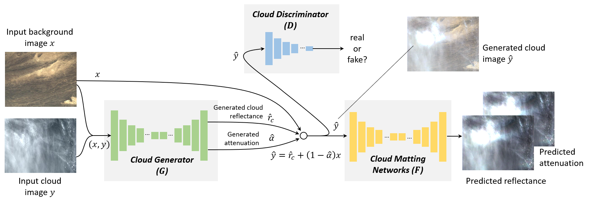

# Overview

__Generative Adversarial Training for Weakly Supervised Cloud Matting, in ICCV 2019. [Paper](<http://openaccess.thecvf.com/content_ICCV_2019/papers/Zou_Generative_Adversarial_Training_for_Weakly_Supervised_Cloud_Matting_ICCV_2019_paper.pdf>)__

The detection and removal of cloud in remote sensing images are essential for earth observation applications. Most previous methods consider cloud detection as a pixel-wise semantic segmentation process (cloud v.s. background), which inevitably leads to a category-ambiguity problem when dealing with semi-transparent clouds. In this project, we re-examine the cloud detection under a totally different point of view, i.e. to formulate it as a mixed energy separation process between foreground and background images, which can be equivalently implemented under an image matting paradigm with a clear physical significance. We further propose a generative adversarial framework where the training of our model neither requires any pixel-wise ground truth reference nor any additional user interactions. Our model consists of three networks, a cloud generator G, a cloud discriminator D, and a cloud matting network F, where G and D aim to generate realistic and physically meaningful cloud images by adversarial training, and F learns to predict the cloud reflectance and attenuation. 



In this repository, we implement the training and testing of the cloud matting model with tensorflow and also release the dataset we used in our paper. With the code, you can also try on your own dataset by following the instructions below.

# Requirements

- Python 3.5
- Tensorflow 1.9
- CUDA 9.0
- CUDNN 7.5

See also in [Requirements.txt](requirements.txt).

# Setup

1. Clone this repo:

   ```
   git clone https://github.com/flyakon/CloudMattingGAN.git 
   cd CloudMattingGAN
   ```

2. Here we only upload a small part of our dataset. The complete dataset can be downloaded from: 1) [Google Driver](https://drive.google.com/open?id=1MIBstoZI1hJ2Rio2CP5Gq1KLJ0IVC1Rd); 2) [BaiduYun](https://pan.baidu.com/s/17Lfh5LpXrTsxkwFdoi_Jhw) (Key: 0626).


3. Train Cloud Matting Net

   It is recommended firstly to train the Generative Adversarial Networks for 2000 steps.(Optional)

   ``````shell
   python cloud_generation.py --checkpoint_gan=model/LSGAN  \
   						   --gan_model=LSGAN \
   						   --sample_dir=sample \
   						   --iter_step=2001 \
   						   --image_dir=dataset/train
   ``````


   ``````shell
   python train.py --gan_model=LSGAN \
   				--batch_size=2 \
   				--model_path=model/CloudMattingNet_LSGAN \
   				--net_name=mattingnet \
   				--logdir=log \
   				--sample_dir=sample \
   				--iter_step=38002 \
   				--image_dir=dataset/train \
   				--checkpoint_gan=model/LSGAN \
   				--sample_dir=sample
   ``````


4. Test Cloud Matting Net

   ``````shell
   python test.py  --model_path=model/CloudMattingNet_LSGAN \
   				--net_name=mattingnet  \
   				--testDataPath=dataset\test\thin_slice \
   				--result_path=result
   ``````

# Citation

If you find the code useful, please cite:

``````
@InProceedings{Zou_2019_ICCV,
author = {Zou, Zhengxia and Li, Wenyuan and Shi, Tianyang and Shi, Zhenwei and Ye, Jieping},
title = {Generative Adversarial Training for Weakly Supervised Cloud Matting},
booktitle = {The IEEE International Conference on Computer Vision (ICCV)},
month = {October},
year = {2019}
}
``````

